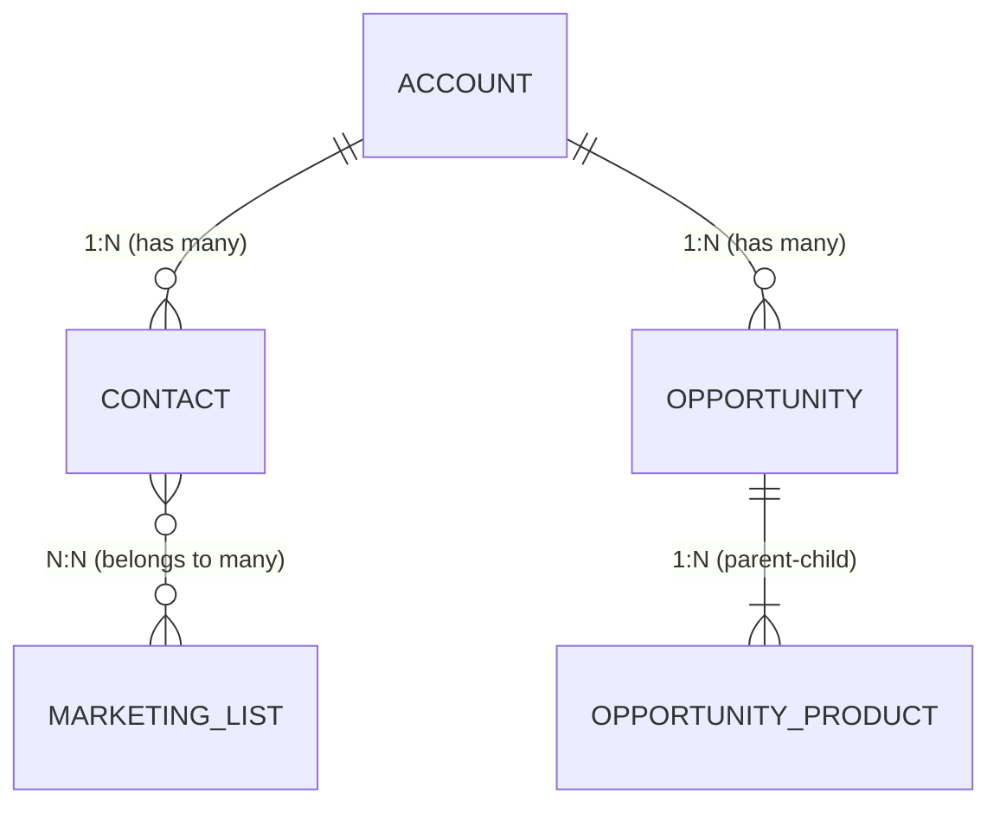
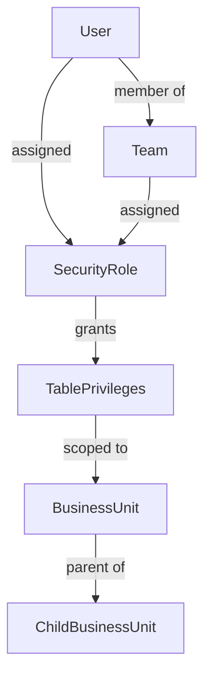

# Dataverse

Dataverse is the core data platform underpinning Dynamics 365 and much of the Power Platform.

## Platform Overview

```
┌─────────────────────────────────────────────┐
│              Power Platform                 │
│  Power Apps │ Power Automate │ Power Pages  │
├─────────────────────────────────────────────┤
│              Dynamics 365 Apps              │
│   Sales │ Customer Service │ Field Service  │
├─────────────────────────────────────────────┤
│                 Dataverse                   │
│   Tables │ Relationships │ Security Roles   │
│   Business Rules │ Plugins │ APIs           │
└─────────────────────────────────────────────┘
```

## Core Concepts

Common building blocks include:

- tables
- columns
- relationships
- business rules
- forms
- views
- choices
- security roles
- business process flows

## Table Naming Conventions

Custom tables and columns must have a publisher prefix. Keep names consistent and descriptive.

```
Standard table:       account, contact, opportunity
Custom table:         prefix_projectrequest
Custom column:        prefix_approvalstatus, prefix_estimatedvalue
Choice (global):      prefix_priority
```

Avoid abbreviations that obscure intent. `prefix_reqstat` is less clear than `prefix_requeststatus`.

## Design Principles

When designing Dataverse solutions:

- use clear table ownership and security design
- choose relationships carefully
- avoid unnecessary complexity in data model extensions
- separate configuration data from transactional data
- think about reporting and integration impacts early

## Table Design Tips

- use consistent naming conventions
- document purpose and ownership of custom tables
- avoid creating duplicate concepts across multiple tables
- keep required columns meaningful
- be careful with large text and file storage where not needed

## Relationship Design Tips

Think carefully about:

- 1:N relationships
- N:1 relationships
- N:N relationships
- cascading behaviour
- parent-child data ownership
- integration implications

### Relationship Type Overview



### Cascade Behaviour Options

| Behaviour       | Assign | Share | Unshare | Reparent | Delete | Merge |
|-----------------|--------|-------|---------|----------|--------|-------|
| Cascade All     | ✓      | ✓     | ✓       | ✓        | ✓      | ✓     |
| Cascade Active  | ✓      | ✓     | ✓       | ✓        |        |       |
| Cascade User    | ✓      | ✓     | ✓       | ✓        |        |       |
| Restrict        |        |       |         |          | ✗      |       |
| None            |        |       |         |          |        |       |

## Security Model Overview



Privileges are additive — a user with multiple roles gets the union of all privileges.

## Common Mistakes

- overcustomising without documenting rationale
- putting too much process logic into data structure
- poor naming of schema objects
- creating fields that duplicate existing Dynamics functionality
- ignoring downstream reporting and integration needs

## Practical Questions to Ask

- who owns the record?
- who can read it?
- who can modify it?
- does this belong in Dataverse at all?
- will external systems need this data?
- should this logic be implemented in a plugin, flow, or external service?