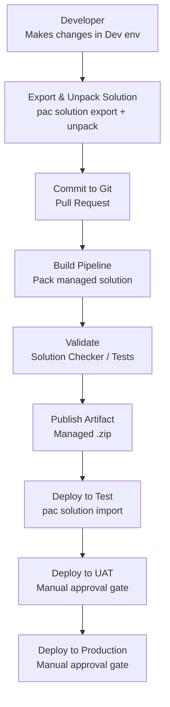

# DevOps

Dynamics 365 delivery benefits from disciplined DevOps practices even when some assets are low-code.

## Core Areas

- source control
- solution export and unpack
- build validation
- environment promotion
- release governance
- deployment documentation

## CI/CD Pipeline Overview



## Azure DevOps — Build Pipeline (YAML)

```yaml
trigger:
  branches:
    include:
      - main

pool:
  vmImage: ubuntu-latest

steps:
  - task: PowerPlatformToolInstaller@2
    displayName: Install Power Platform Tools

  - task: PowerPlatformSetConnectionVariables@2
    displayName: Set Connection Variables
    inputs:
      authenticationType: PowerPlatformSPN
      PowerPlatformSPN: $(ServiceConnection)

  - task: PowerPlatformPackSolution@2
    displayName: Pack Managed Solution
    inputs:
      SolutionSourceFolder: solutions/MySolution
      SolutionOutputFile: $(Build.ArtifactStagingDirectory)/MySolution_managed.zip
      SolutionType: Managed

  - task: PublishBuildArtifacts@1
    displayName: Publish Artifact
    inputs:
      PathtoPublish: $(Build.ArtifactStagingDirectory)
      ArtifactName: solutions
```

## Azure DevOps — Release Pipeline (YAML)

```yaml
steps:
  - task: PowerPlatformToolInstaller@2
    displayName: Install Power Platform Tools

  - task: PowerPlatformImportSolution@2
    displayName: Import Solution to Test
    inputs:
      authenticationType: PowerPlatformSPN
      PowerPlatformSPN: $(ServiceConnectionTest)
      SolutionInputFile: $(Pipeline.Workspace)/solutions/MySolution_managed.zip
      AsyncOperation: true
      MaxAsyncWaitTime: 60
      PublishWorkflows: true

  - script: |
      pac auth create --url $(TestEnvironmentUrl) --applicationId $(AppId) --clientSecret $(ClientSecret) --tenant $(TenantId)
      pac solution check --path $(Pipeline.Workspace)/solutions/MySolution_managed.zip --outputDirectory $(Build.ArtifactStagingDirectory)/checker
    displayName: Run Solution Checker
```

## PAC CLI — Pipeline Authentication

```powershell
# Authenticate using service principal (for CI/CD pipelines)
pac auth create `
  --url https://yourorg.crm6.dynamics.com `
  --applicationId $env:APP_ID `
  --clientSecret $env:CLIENT_SECRET `
  --tenant $env:TENANT_ID

# Run solution checker
pac solution check `
  --path ./solutions/MySolution_managed.zip `
  --geo Australia

# Publish customisations after import
pac solution publish
```

## Post-Deployment Checklist

```
[ ] Solution imported without errors
[ ] Solution checker issues reviewed
[ ] Flows activated
[ ] Connection references configured
[ ] Environment variables set
[ ] Security roles assigned
[ ] Smoke test completed
[ ] Deployment notes updated
```

## Practical Guidance

- keep solution assets in source control
- automate exports and packaging where possible
- document deployment order
- validate environment variables and connection references
- include smoke-test steps after deployment
- track solution versions properly

## Useful Pipeline Concerns

Think about:

- build agent requirements
- authentication to environments
- managed versus unmanaged build outputs
- release approvals
- deployment sequencing
- rollback or remediation steps

## Good Delivery Practice

A strong Dynamics delivery process should include:

- source-controlled solution assets
- repeatable build steps
- repeatable deployment steps
- release notes
- post-deployment validation
- operational ownership

## Common Delivery Failures

- deployment succeeds but app is unusable
- flows are inactive after import
- connection references point nowhere
- environment variables are missing
- undocumented manual steps break repeatability
- solution layering causes unexpected behaviour