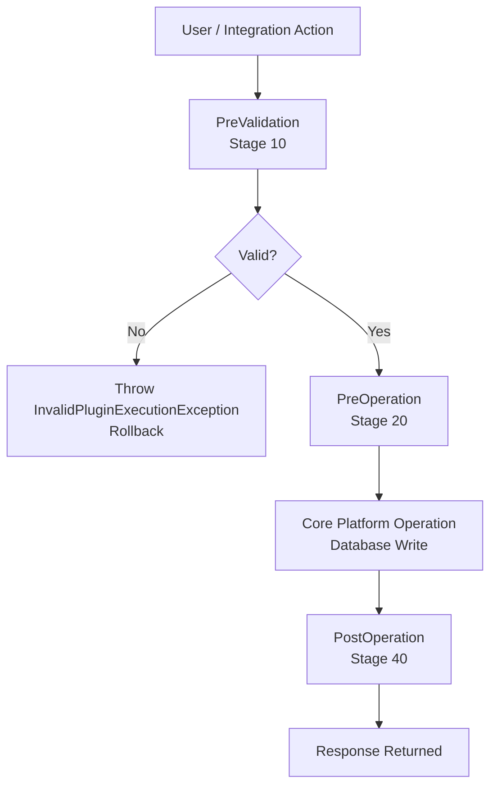

# Plugin Development

Plugins are used to enforce server-side business logic in Dynamics 365 and Dataverse.

## When Plugins Are Useful

Plugins are commonly used when you need:

- synchronous server-side validation
- automatic field updates
- creation of related records
- enforcement of business rules
- integration triggers
- logic that should not rely on client-side behaviour

## Plugin Pipeline Stages



### Stage Reference

| Stage          | Number | In Transaction | Typical Use                         |
|----------------|--------|----------------|-------------------------------------|
| PreValidation  | 10     | No             | validation before DB transaction    |
| PreOperation   | 20     | Yes            | modify input before write           |
| PostOperation  | 40     | Yes            | create related records, side effects|

## Basic Plugin Skeleton

```csharp
using Microsoft.Xrm.Sdk;
using System;

public class MyPlugin : IPlugin
{
    public void Execute(IServiceProvider serviceProvider)
    {
        var context = (IPluginExecutionContext)serviceProvider
            .GetService(typeof(IPluginExecutionContext));
        var serviceFactory = (IOrganizationServiceFactory)serviceProvider
            .GetService(typeof(IOrganizationServiceFactory));
        var tracingService = (ITracingService)serviceProvider
            .GetService(typeof(ITracingService));

        var service = serviceFactory.CreateOrganizationService(context.UserId);

        tracingService.Trace("MyPlugin: execution started");

        if (context.InputParameters.Contains("Target")
            && context.InputParameters["Target"] is Entity target)
        {
            // your logic here
        }
    }
}
```

## Reading and Writing Attributes

```csharp
// Read a string attribute safely
var name = target.GetAttributeValue<string>("name");

// Read a Money value
var amount = target.GetAttributeValue<Money>("totalamount")?.Value ?? 0m;

// Read an OptionSetValue (choice)
var statusCode = target.GetAttributeValue<OptionSetValue>("statuscode")?.Value;

// Read a lookup
var ownerId = target.GetAttributeValue<EntityReference>("ownerid");

// Set a value
target["prefix_approvalstatus"] = new OptionSetValue(100000001);

// Throw a user-visible validation error
throw new InvalidPluginExecutionException("Record cannot be submitted without an estimated value.");
```

## Querying from a Plugin

```csharp
// QueryExpression
var query = new QueryExpression("opportunity")
{
    ColumnSet = new ColumnSet("name", "estimatedvalue", "statecode"),
    Criteria =
    {
        Conditions =
        {
            new ConditionExpression("parentaccountid", ConditionOperator.Equal, accountId),
            new ConditionExpression("statecode", ConditionOperator.Equal, 0)
        }
    }
};

var results = service.RetrieveMultiple(query);
foreach (var opp in results.Entities)
{
    tracingService.Trace($"Opportunity: {opp.GetAttributeValue<string>("name")}");
}
```

## Creating a Related Record

```csharp
var task = new Entity("task")
{
    ["subject"]     = "Follow-up required",
    ["regardingobjectid"] = new EntityReference("account", accountId),
    ["scheduledend"] = DateTime.UtcNow.AddDays(7)
};

service.Create(task);
```

## Good Plugin Practices

- keep plugin logic focused
- avoid overly large "god classes"
- trace meaningful diagnostic information
- validate required input early
- handle recursion carefully
- minimise unnecessary service calls
- extract reusable logic into separate classes where appropriate

## Things to Watch

- recursive updates
- performance issues
- transaction impact
- unexpected triggering from imports or integrations
- multiple plugins interacting on the same message

## Registration Considerations

Think about:

- message
- primary table
- stage
- filtering attributes
- execution mode
- deployment approach

## Typical Use Cases

- calculate derived values on create or update
- enforce consistency rules
- create or update related records
- call downstream services through controlled integration patterns
- validate status transitions

## Avoid When Possible

A plugin may not be the best choice when:

- simple no-code configuration is enough
- process belongs in Power Automate
- logic is long-running
- integration requires resilient async processing better suited to Azure or queue-based patterns