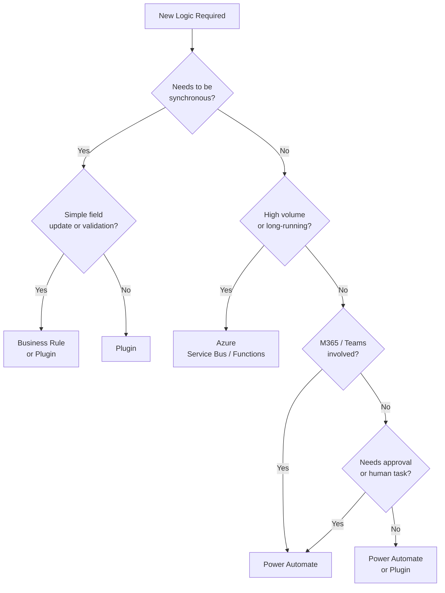

# Power Automate

Power Automate is useful for workflow-style automation around Dynamics 365 and Dataverse.

## Good Use Cases

- notifications
- approvals
- low-complexity record processing
- scheduled housekeeping
- integration with Microsoft 365 services
- orchestration of lightweight business processes

## Be Careful With

- high-volume transaction processing
- complex branching logic
- long-term maintainability
- performance-sensitive synchronous requirements
- flows that become critical integration backbones without governance

## Automation Decision Guide

Use this to decide where business logic should live:



## Common Flow Patterns

### Triggered on Record Change

```
Trigger:  When a row is added, modified, or deleted
          Table: opportunity | Trigger condition: row is modified
          Filtering attributes: statuscode

Condition: statuscode equals "Won"

Actions:
  → Send email notification to account manager
  → Create task: "Send welcome kit"
  → Update related account: lastopportunitydate = today
```

### Approval Pattern

```
Trigger:  When a row is added
          Table: prefix_leaverequest

Action:   Start and wait for an approval
          Type: Approve/Reject – First to respond
          Assigned to: manager email

Condition: Outcome equals "Approve"
  Yes → Update row: prefix_approvalstatus = Approved
  No  → Update row: prefix_approvalstatus = Rejected
        Send rejection email
```

### Scheduled Housekeeping

```
Trigger:  Recurrence
          Frequency: Day | Interval: 1 | Start time: 01:00 UTC

Action:   List rows
          Table: task
          Filter: statecode eq 1 and modifiedon lt [utcNow(-30d)]

Apply to each:
  → Delete row
```

## Environment Variable Usage

Always use environment variables for environment-specific values such as email addresses, team IDs, and SharePoint site URLs.

```
Environment Variable: prefix_NotificationEmailAddress
Type: String
Default value: notifications@dev.example.com

Used in flow action: Send an email
  To: @{parameters('prefix_NotificationEmailAddress')}
```

This lets the same solution deploy to test and production without manual edits.

## Practical Guidance

- name flows clearly
- document ownership
- use service accounts where governance requires it
- handle failures explicitly
- avoid hidden dependencies
- review trigger conditions carefully
- keep solution-aware deployment in mind

## Typical Decision Point

Ask:

- should this be a flow?
- should this be a plugin?
- should this be Azure integration instead?

## Common Problems

- flow owner leaves team
- environment variables missing
- connection references not configured
- unexpected re-triggering
- poor error visibility
- excessive dependence on manual fixes