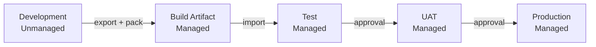
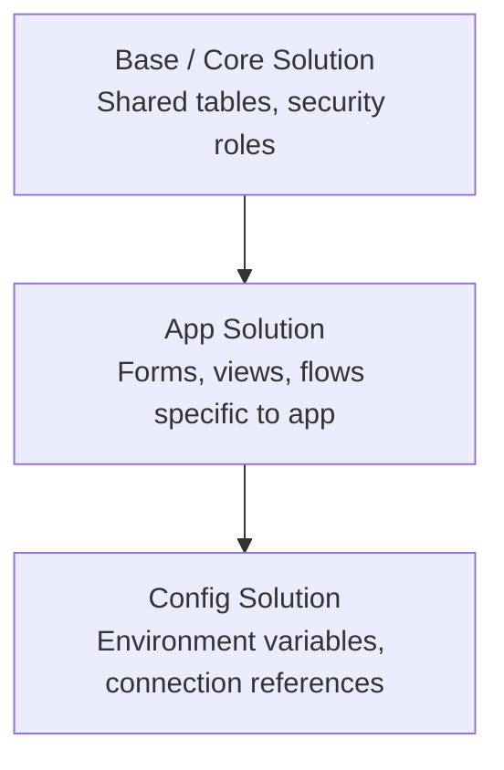

# Solution Management

Solution management is central to delivering Dynamics 365 changes safely across environments.

## Key Concepts

- unmanaged solutions
- managed solutions
- publishers
- patches
- versioning
- environment variables
- connection references

## Environment Promotion Flow



Always export from development as **unmanaged**, pack as **managed**, and deploy managed to all downstream environments.

## Solution Layering



Keep layers intentional. Circular dependencies between solutions cause import failures.

## PAC CLI — Common Commands

```powershell
# Authenticate to an environment
pac auth create --url https://yourorg.crm6.dynamics.com

# List authenticated profiles
pac auth list

# Export an unmanaged solution
pac solution export `
  --name YourSolutionName `
  --path ./solutions/YourSolutionName.zip `
  --managed false

# Unpack solution zip to source files (for source control)
pac solution unpack `
  --zipfile ./solutions/YourSolutionName.zip `
  --folder ./solutions/YourSolutionName `
  --packagetype Unmanaged

# Pack source files back into a managed zip
pac solution pack `
  --zipfile ./solutions/YourSolutionName_managed.zip `
  --folder ./solutions/YourSolutionName `
  --packagetype Managed

# Import a managed solution
pac solution import `
  --path ./solutions/YourSolutionName_managed.zip `
  --activate-plugins true

# Check solution version
pac solution list
```

## Versioning Convention

Use four-part versioning: `major.minor.patch.build`

```
1.0.0.0    initial release
1.0.1.0    patch / hotfix
1.1.0.0    minor feature addition
2.0.0.0    major change or breaking redesign
```

Increment version before every export intended for deployment. Source control tags should align.

## Practical Guidance

- use consistent publisher strategy
- keep solution boundaries intentional
- avoid unmanaged drift in shared environments
- version changes clearly
- document deployment prerequisites
- understand dependencies before release

## Good Habits

- separate experimental work from releasable assets
- include related components deliberately
- validate app, flow, and connection dependencies
- use environment variables for environment-specific values
- keep release notes for each deployment

## Common Problems

- missing dependencies
- unmanaged customisations in target environments
- connection references not set correctly
- incorrect layering assumptions
- unclear rollback plan
- solution import succeeds but runtime configuration is incomplete

## Questions Before Release

- what exactly changed?
- what depends on it?
- is post-deployment configuration required?
- are flows turned on?
- are connection references valid?
- are security roles and access impacts understood?